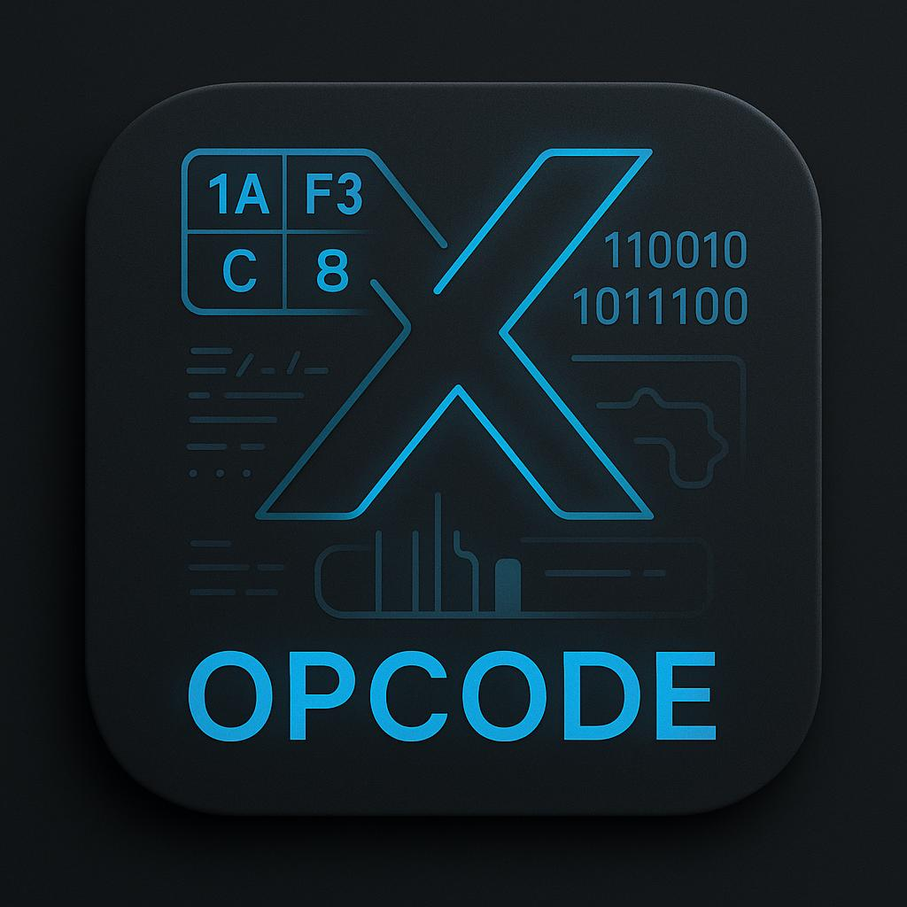
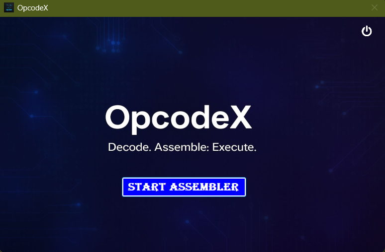
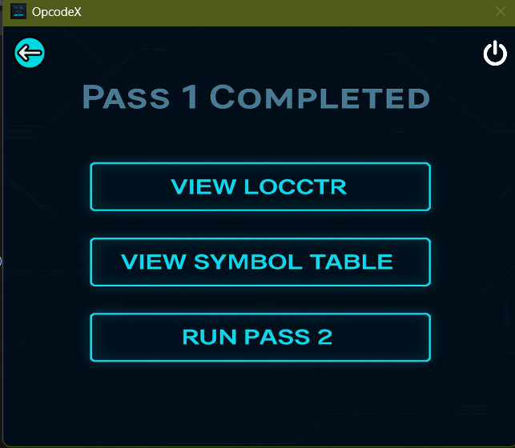
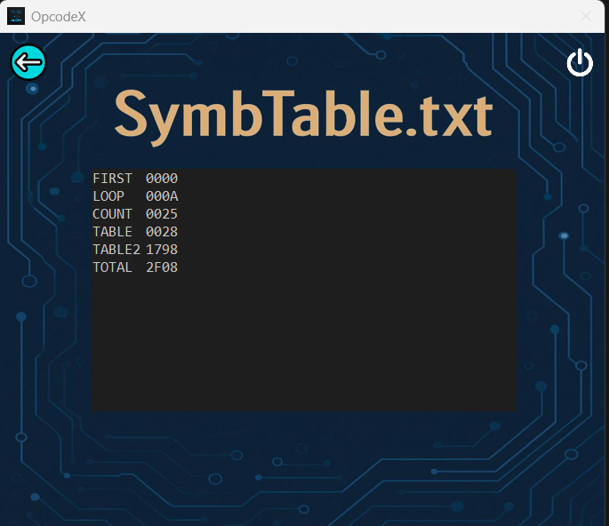
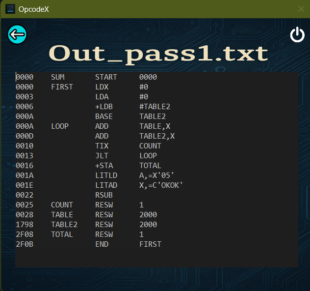
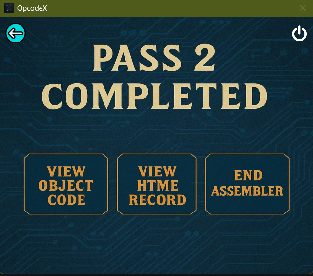
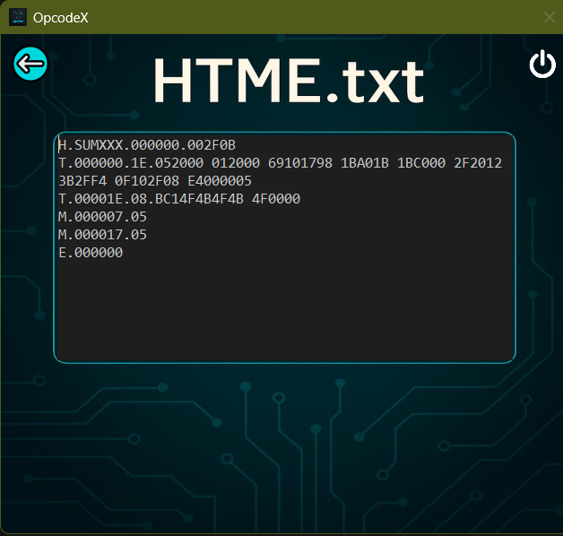
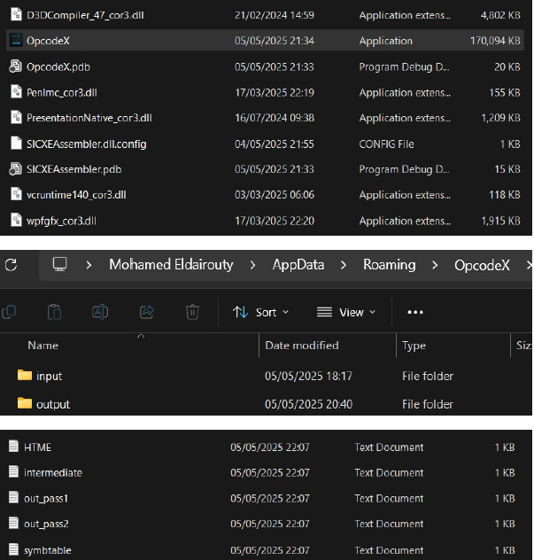

<p align="center">
  
</p>

<h1 align="center">💻 OpcodeX – SIC/XE Assembler Simulator</h1>

<p align="center"><b>C# | .NET 8 | Windows Forms | Assemblers</b></p>

---

## 📘 Description

OpcodeX is a modern SIC/XE assembler simulator built using C# and Windows Forms. Designed to decode, assemble, and execute assembly code, it provides a sleek, interactive desktop interface for students and enthusiasts to visualize every step of the assembling process.

It streamlines the learning experience by offering an intuitive interface, real-time code analysis, and full pass-by-pass feedback—all packed into a standalone desktop app.

---

## 💡 Highlights

- ⚙️ Full Pass 1 & Pass 2 assembly simulation  
- ✍️ Clean UI for editing assembly input (`in.txt`) and viewing outputs  
- 🧾 Automatic generation of intermediate, LOCCTR, symbol table, object code, and HTME with M records  
- 📁 Smart directory handling (input/output auto-setup in `AppData`)  
- 🧠 Support for format 1–4 instructions, PC & base-relative addressing  
- 🖥️ Fully responsive, stylish Windows Forms GUI  

---

## 📂 Project Structure

```
OpcodeX/
├── Code/
│   ├── OpcodeX/              # GUI Windows Forms App
│   └── SICXEAssembler/       # Backend Assembler Engine
├── Report/                   # Final project report
├── Input_Output Sample/
│   ├── input/                # Sample assembly input
│   └── output/               # Generated output files
├── Demo Video/               # Demo video file
├── Screenshots/              # App preview screenshots
```

---

## 🛠️ Skills Demonstrated

`.NET architecture`, `assembler design`, `low-level memory handling`, `two-pass logic`,  
`Windows Forms GUI development`, `file I/O`, `C# debugging`.

---

## 📦 Download Executable

🔗 [Download OpcodeX Application (ZIP)](https://drive.google.com/file/d/1OVpDVh2V-cbiI5pj1qrr9gyGqaFCGRDj/view?usp=sharing)

---

## 🖼️ Preview (Screenshots)

| Home | Input | Pass 1 |
|------|-------|--------|
|  |  |  |

| Symbol Table | LOCCTR | Object Code |
|--------------|--------|-------------|
|  |  |  |

| Pass 2 | HTME | Sample Run |
|--------|------|------------|
|  |  |  |

---

> 🚀 Built by Mohamed Eldairouty  
